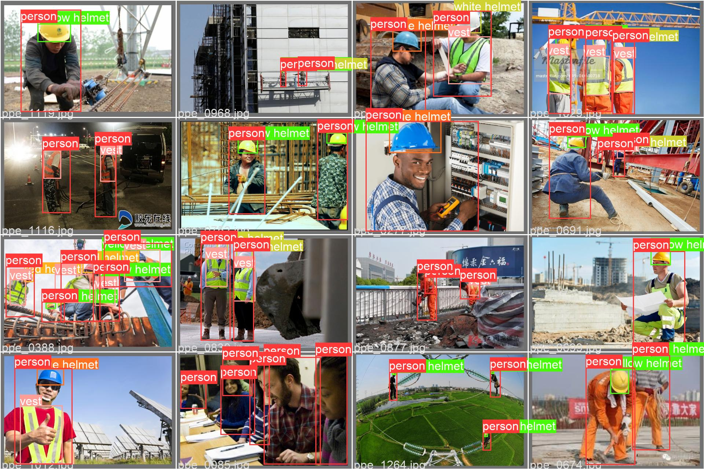
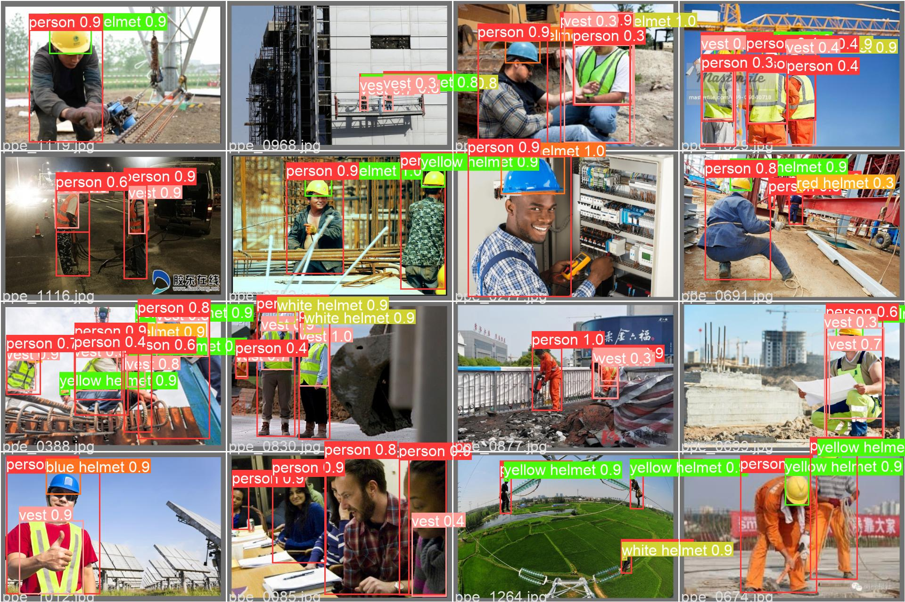

<div align="center">

# 🏗️ YOLOv5n 工地 PPE 智能防护检测系统

**基于 YOLOv5n的实时工地安全装备检测方案**


[](https://www.python.org/)
[](https://pytorch.org/)
[](https://github.com/ultralytics/yolov5)
[](https://developer.nvidia.com/tensorrt)
[](https://developer.nvidia.com/deepstream-sdk)
[](#)

</div>

---

> ⚠️ 本项目是本人授课使用，请仅做个人学习、研究使用。

## 📌 项目简介

本项目基于 **YOLOv5n** 轻量级目标检测模型，实现对工地现场人员 **个人防护装备 (PPE, Personal Protective Equipment)** 的实时智能检测。系统可识别6类目标：**人员 (person)**、**反光背心 (vest)**、**蓝色安全帽**、**红色安全帽**、**白色安全帽**、**黄色安全帽**，并通过 **IOU 关联算法** 将检测到的帽子和背心与人体框进行语义绑定，实现逐人状态判断（是否佩戴安全帽、是否穿着反光背心）。

支持多种推理部署方式：
| 部署方式 | 文件 | 适用平台 | 预期帧率 |
|---------|------|---------|---------|
| **PyTorch 推理** | `demo.py` | PC (Windows/macOS/Linux) | ~10-15 FPS |
| **PyTorch FP16 半精度** | `detect.py --half` | GPU 服务器 | ~10 FPS (97.5ms/帧) |
| **ONNX GPU 加速** | `detect.py --weights *.onnx` | GPU 服务器 (CUDA 11.x) | **~40 FPS (24.9ms/帧)** |


---

## 🔬 创新点与技术亮点

### 1. 💡 轻量化模型选择 — YOLOv5n
- 选用 YOLOv5 **Nano** 版本（仅 **1.9M 参数量**，**4.5 GFLOPs**），在保证检测精度的前提下大幅降低计算需求。

### 2. 🧠 基于 IOU 的人-装备语义关联
- 传统检测仅输出独立的目标框。本项目引入 **IOU（交并比）关联机制**，通过计算人体框与帽子框/背心框的 IOU 值，将装备检测结果绑定到对应人员，实现 **逐人安全状态判断**。
- 该方法避免了复杂的 ReID 或 Tracking 算法，在保证关联准确性的同时具有极低的计算开销。

### 3. 🖼️ 状态可视化浮层渲染
- 采用 **图标浮层 (Overlay Icon)** 方式直观展示每位人员的装备佩戴状态，包括安全帽颜色和背心穿戴情况。
- 当人员未佩戴安全帽或未穿反光背心时，显示对应的 **警告图标**，便于安全监管人员快速识别违规情况。

### 4. 📊 多模型对比训练
- 同时训练了 YOLOv5 **n / s / m / n6** 四个规模的模型，提供完整的精度-速度 trade-off 参考，方便用户根据自身硬件条件选择最优模型。

---

## 🏗️ 系统架构

```
┌─────────────────────────────────────────────────────────┐
│                    摄像头输入 (USB/RTSP)                   │
└─────────────┬───────────────────────────────────────────┘
              │
              ▼
┌─────────────────────────────────────────────────────────┐
│          YOLOv5n 目标检测 (6类目标)                       │
│   person / vest / blue helmet / red helmet /             │
│   white helmet / yellow helmet                           │
└─────────────┬───────────────────────────────────────────┘
              │
              ▼
┌─────────────────────────────────────────────────────────┐
│        IOU 关联引擎 — 人-装备绑定                         │
│   • 计算 person 框与 helmet 框的 IOU                     │
│   • 计算 person 框与 vest 框的 IOU                       │
│   • 生成 person_info_list                                │
└─────────────┬───────────────────────────────────────────┘
              │
              ▼
┌─────────────────────────────────────────────────────────┐
│        可视化渲染 & 状态告警                               │
│   • 绘制检测框 + 置信度                                   │
│   • 叠加安全帽/背心状态图标                                │
│   • FPS 与人员计数显示                                    │
└─────────────────────────────────────────────────────────┘
```

---

## 一、硬件要求

| 组件 | 说明 |
|------|------|
| **PC 端** | Windows 10/11（无需 GPU）或 macOS 均测试可行 |
| **摄像头** | USB RGB 摄像头 |

## 二、软件依赖

| 软件 | 版本要求 |
|------|---------|
| Python | == 3.8 |
| PyTorch | >= 1.8.0 |
| YOLOv5 | v6.0 |
| OpenCV | >= 4.1.1 |
| NumPy | >= 1.22.2 |

## 三、快速开始

### 📥 1. 克隆项目

```bash
git clone https://github.com/hexuanJ/YOLOv5-.git
cd YOLOv5-
```

### 📦 2. 准备 YOLOv5 环境

参考 [YOLOv5 官网](https://github.com/ultralytics/yolov5)，将 YOLOv5 clone 到本项目 `yolov5` 目录（当前 YOLOv5 目录为空，替换即可）：

```bash
git clone https://github.com/ultralytics/yolov5.git yolov5
cd yolov5
pip install -r requirements.txt
cd ..
```

### ⬇️ 3. 下载权重文件

下载训练好的权重文件（如 `ppe_yolo_n.pt`）放到 `weights` 目录下：

👉 [权重下载地址](https://github.com/enpeizhao/CVprojects/releases/tag/Models)

### ▶️ 4. 运行检测

```bash
# PC 端 PyTorch 推理
python demo.py

### ⚡ 5. ONNX GPU 加速推理部署

> 在 Tesla V100S-PCIE-32GB 上实测，ONNX GPU 推理速度为 **24.9ms/帧**，相比 PyTorch FP16（97.5ms/帧）快约 **4 倍**，相比 ONNX CPU 回退（357.7ms/帧）快约 **14 倍**。

#### 实测性能对比（Tesla V100S-PCIE-32GB）

| 推理方式 | 推理速度 (inference) | 加速比 | 状态 |
|---------|---------------------|--------|------|
| ONNX CPU（回退） | 357.7 ms | 1x（基准） |  GPU 未启用 |
| PyTorch FP16 | 97.5 ms | 3.7x | 可用 |
| **ONNX GPU** | **24.9 ms** | **14.4x** | **最佳方案** |

#### 测试环境

| 项目 | 版本 |
|------|------|
| GPU | Tesla V100S-PCIE-32GB |
| Python | 3.10.11 |
| PyTorch | 2.0.1+cu118 |
| ONNX Runtime GPU | 1.16.3 |
| ONNX | 1.20.1 |

#### 方式一：一键配置（推荐）

```bash
# 运行一键配置脚本
chmod +x setup_onnx_gpu.sh
./setup_onnx_gpu.sh
```

#### 方式二：手动配置

**Step 1：安装依赖**

```bash
# 安装 ONNX 相关
pip install onnx
pip uninstall onnxruntime onnxruntime-gpu -y 2>/dev/null
pip install onnxruntime-gpu==1.16.3

# 安装 NVIDIA CUDA 运行时库
pip install nvidia-cuda-runtime-cu11 nvidia-cublas-cu11 nvidia-curand-cu11 \
            nvidia-cusolver-cu11 nvidia-cusparse-cu11 nvidia-cufft-cu11
```

> ⚠️ `onnxruntime-gpu` 必须安装 **1.16.3** 版本，该版本兼容 CUDA 11.8。默认 `pip install onnxruntime-gpu` 会安装最新版（要求 CUDA 12），与 CUDA 11.x 环境不兼容。

**Step 2：创建符号链接**

PyTorch 自带的 `libnvrtc` 文件名带有哈希后缀，cuDNN 加载时找不到，需要创建符号链接：

```bash
TORCH_LIB=$(python -c "import torch; print(torch.__path__[0])")/lib
NVRTC_FILE=$(ls ${TORCH_LIB}/libnvrtc-*.so.* 2>/dev/null | head -1)
ln -sf "$NVRTC_FILE" "${TORCH_LIB}/libnvrtc.so"
```

**Step 3：设置环境变量**

```bash
export LD_LIBRARY_PATH=$(python -c "import torch; print(torch.__path__[0])")/lib:/usr/local/lib/python3.10/site-packages/nvidia/curand/lib:/usr/local/lib/python3.10/site-packages/nvidia/cublas/lib:/usr/local/lib/python3.10/site-packages/nvidia/cuda_runtime/lib:/usr/local/lib/python3.10/site-packages/nvidia/cusolver/lib:/usr/local/lib/python3.10/site-packages/nvidia/cusparse/lib:/usr/local/lib/python3.10/site-packages/nvidia/cufft/lib:$LD_LIBRARY_PATH
```

如需持久化（重启终端自动生效），将上述 `export` 命令追加到 `~/.bashrc`：

```bash
echo 'export LD_LIBRARY_PATH=...(同上)...' >> ~/.bashrc
```

**Step 4：验证 ONNX GPU**

```bash
python -c "import onnxruntime as ort; print('Providers:', ort.get_available_providers())"
```

输出中应包含 `CUDAExecutionProvider`。

**Step 5：导出 ONNX 模型**

```bash
cd yolov5
python export.py --weights yolov5n.pt --include onnx --device 0 --simplify
```

> ⚠️ 推荐使用 **FP32** 导出（不加 `--half`），避免推理时数据类型不匹配。

**Step 6：ONNX GPU 推理**

```bash
# 对图片推理
python detect.py --weights yolov5n.onnx --source data/images/ --device 0 --name result --exist-ok

# 对视频推理
python detect.py --weights yolov5n.onnx --source video.mp4 --device 0 --name result --exist-ok
```

#### 常见问题

| 错误信息 | 原因 | 解决方案 |
|---------|------|---------|
| `Require cuDNN 9.* and CUDA 12.*` | onnxruntime-gpu 版本过高 | `pip install onnxruntime-gpu==1.16.3` |
| `libcurand.so.10: cannot open` | 缺少 CUDA 库 | `pip install nvidia-curand-cu11` |
| `libcufft.so.10: cannot open` | 缺少 cufft 库 | `pip install nvidia-cufft-cu11` |
| `libnvrtc.so: cannot open` | PyTorch 库文件名带哈希 | 创建 `libnvrtc.so` 符号链接（见 Step 2） |
| `expected: (tensor(float16))` | 模型用 --half 导出 | 重新导出 FP32 模型（去掉 `--half`） |
| `Failed to open 0` | 云服务器无摄像头 | 使用图片/视频作为 `--source` |

---

## 四、模型评估

### Ground Truths vs 预测对比

| Ground Truths | 模型预测 |
|:---:|:---:|
|  |  |

### 训练模型一览

共训练了 YOLOv5 **n、m、s、n6** 四个模型：


各个模型评估数据如下：

```shell
# n — 4.3 GFLOPs
Class     Images     Labels     P         R        mAP@.5   mAP@.5:.95
all        121        776     0.783     0.693     0.754      0.41
person     121        198     0.863     0.804     0.859     0.504
vest       121         98     0.769     0.643     0.727     0.424
blue       121         92     0.809     0.717     0.785     0.435
red        121        105     0.788     0.724     0.771     0.413
white      121        189     0.706       0.6     0.647     0.315
yellow     121         94     0.764     0.67      0.736     0.371

# s — 15.8 GFLOPs
Class     Images     Labels     P         R        mAP@.5   mAP@.5:.95
all        121        776     0.832     0.741     0.794     0.461
person     121        198     0.883     0.828     0.876     0.553
vest       121         98     0.816     0.735     0.797     0.499
blue       121         92     0.831     0.761     0.826     0.485
red        121        105     0.849     0.79      0.817     0.471
white      121        189     0.784     0.651     0.688     0.357
yellow     121         94     0.832     0.681     0.762     0.402

# m — 47.9 GFLOPs
Class     Images     Labels     P         R        mAP@.5   mAP@.5:.95
all        121        776     0.865     0.743     0.819     0.487
person     121        198     0.932     0.813     0.893     0.576
vest       121         98     0.836     0.765     0.815     0.508
blue       121         92     0.861     0.761     0.829     0.489
red        121        105     0.876     0.78      0.844     0.503
white      121        189     0.815     0.653     0.725     0.4
yellow     121         94     0.868     0.685     0.805     0.443

# n6 — 5.4 GFLOPs (P6 模型，输入 1280px)
Class     Images     Labels     P         R        mAP@.5   mAP@.5:.95
all        121        776     0.785     0.701     0.762     0.422
person     121        198     0.865     0.798     0.858     0.519
vest       121         98     0.761     0.684     0.737     0.432
blue       121         92     0.805     0.728     0.785     0.436
red        121        105     0.79      0.724     0.781     0.428
white      121        189     0.72      0.597     0.666     0.33
yellow     121         94     0.767     0.676     0.746     0.387
```

---

## 五、核心代码解析

### 📄 `demo.py` — PyTorch 推理入口

| 模块 | 功能 |
|------|------|
| `PPE_detect.__init__()` | 加载 YOLOv5n 模型、设置置信度阈值、初始化摄像头、加载状态图标 |
| `get_iou()` | 计算两个矩形框的 IOU，用于人-装备关联 |
| `get_person_info_list()` | 遍历每个人体框，通过 IOU 与帽子框/背心框进行匹配绑定 |
| `render_frame()` | 在画面上绘制检测框、置信度文本、状态图标浮层 |
| `detect()` | 主循环：读取帧 → 推理 → 关联 → 渲染 → 显示 |

---

## 六、项目结构

```
YOLOv5-/
├── demo.py                          # PyTorch 推理主程序
├── setup_onnx_gpu.sh                # ONNX GPU 一键配置脚本
├── weights/                         # 模型权重文件目录
│   └── ppe_yolo_n.pt               # YOLOv5n PPE 检测权重
├── icons/                           # 状态显示图标
│   ├── person.png                   # 人员图标
│   ├── vest_on.png                  # 穿背心图标
│   ├── vest_off.png                 # 未穿背心警告图标
│   ├── hat_blue.png                 # 蓝色安全帽
│   ├── hat_red.png                  # 红色安全帽
│   ├── hat_white.png                # 白色安全帽
│   ├── hat_yellow.png               # 黄色安全帽
│   └── hat_off.png                  # 未戴帽子警告图标
├── imgs/                            # 验证集可视化结果
├── yolov5/                          # YOLOv5 框架（需自行 clone）
└── README.md                        # 项目说明文档
```

---
## 七、 推理加速技术原理详解

> 本节对项目中涉及的四种推理加速方式（PyTorch FP32 → FP16 → ONNX）所用到的专业术语和底层加速原理进行系统性说明。
>
> **总结：所有加速技术本质上都在做三件事 —— 少算、少搬、少等。**

---

### 📊 三种推理方式对比

| 方式 | 文件 | 速度 | 核心加速手段 |
|------|------|------|------------|
| PyTorch FP32 原生推理 | `demo.py` | ~10-15 FPS | 基线，无优化 |
| PyTorch FP16 半精度 | `detect.py --half` | ~10 FPS (97.5ms) | 降低数值精度 + Tensor Core |
| ONNX Runtime GPU | `detect.py --weights *.onnx` | **~40 FPS (24.9ms)** | 静态图 + C++ 引擎 + 算子融合 |

---

### 🔤 术语详解

#### 1. 动态图 vs 静态图（Dynamic Graph vs Static Graph）

| | 动态图（PyTorch） | 静态图（ONNX / TensorRT） |
|---|---|---|
| **工作方式** | 每帧推理时逐行解释 Python 代码，边定义边执行 | 导出时一次性追踪所有操作，保存为固定计算图 |
| **是否需要 Python** | ✅ 每个算子都要回到 Python 解释器 | ❌ C++ 引擎内部直接执行，全程不需要 Python |
| **能否全局优化** | ❌ 不知道下一步要算什么，无法提前优化 | ✅ 整张图已知，可做全局算子融合、内存规划 |
| **类比** | 每做一步菜都翻一页菜谱 | 提前把菜谱背下来，一口气做完 |

**为什么能加速？** 消除了 Python 解释器在每个算子之间的反复介入开销，并且允许编译器对整张计算图进行全局优化。

本项目导出静态图的代码：
```python
# yolov5/export.py
torch.onnx.export(
    model, im, f,
    do_constant_folding=True,  # 启用常量折叠优化
    input_names=["images"],
    output_names=output_names,
)
```

---

#### 2. Python 解释器开销（Interpreter Overhead）

Python 是逐行翻译、逐行执行的解释型语言，并且有 **GIL（全局解释器锁）** 限制。

PyTorch 推理时的执行流程如下：

```
Python 解释器: 处理 conv1(x)      ← 慢（~微秒级）
    ↓
CUDA Kernel:  执行卷积计算         ← 快（~微秒级）
    ↓
Python 解释器: 处理 bn1(result)   ← 慢
    ↓
CUDA Kernel:  执行归一化           ← 快
    ↓
... 几百个算子重复上述过程
```

**模型有几百个算子，每两个快速 GPU 操作之间都插入一次慢速 Python 调度，累积开销非常可观。** ONNX Runtime 将整个推理放在 C++ 引擎中一口气执行，Python 仅参与一次 `session.run()` 调用。

---

#### 3. FP32 / FP16 / INT8 — 数值精度（Numerical Precision）

| 格式 | 位宽 | 精度 | 数值范围 |
|------|------|------|---------|
| **FP32**（单精度浮点） | 32 bit | ~7 位有效数字 | ±3.4 × 10³⁸ |
| **FP16**（半精度浮点） | 16 bit | ~3-4 位有效数字 | ±65504 |
| **INT8**（8 位整数） | 8 bit | 无小数 | -128 ~ 127 |

本项目中 FP16 的核心代码：
```python
# yolov5/models/common.py — 推理时自动转换
if self.fp16 and im.dtype != torch.float16:
    im = im.half()  # 将输入从 FP32 转为 FP16

# yolov5/export.py — 导出时转换模型
if half and not coreml:
    im, model = im.half(), model.half()  # 模型权重转为 FP16
```

**FP16 为什么能加速？（三个原因）**

| 原因 | 说明 |
|------|------|
| **① 数据量减半，带宽翻倍** | 同一张 640×640 特征图：FP32 = 1.56 MB → FP16 = 0.78 MB，相同显存带宽下传输速度翻倍 |
| **② 解锁 Tensor Core 硬件** | NVIDIA GPU 的 Tensor Core 专为 FP16 矩阵乘法设计，算力比普通 CUDA Core 高 8-16 倍 |
| **③ 对检测精度影响极小** | YOLOv5 权重值通常在 -10 ~ +10 之间，FP16 精度足够，mAP 几乎不降 |

---

#### 4. 显存带宽（Memory Bandwidth）

GPU 由**计算单���（CUDA Cores）** 和**显存（VRAM）** 组成，两者通过"数据通道"连接：

```
┌──────────────┐     显存带宽（如 900 GB/s）     ┌──────────┐
│  CUDA Cores  │ ◄══════════════════════════════► │   VRAM   │
│  (负责计算)   │                                  │ (存数据)  │
└──────────────┘                                  └──────────┘
```

现代 GPU 的计算速度极快，但显存带宽增长跟不上，**CUDA Core 经常在"等数据"**。FP16 把数据量砍半，相当于同样的带宽能传输 2 倍数据，减少等待时间。

---

#### 5. Tensor Core

NVIDIA GPU 上的**专用矩阵运算硬件单元**（Volta 架构 / 2017 年起），独立于普通 CUDA Core：

| | 普通 CUDA Core | Tensor Core |
|---|---|---|
| **单次运算** | 1 次标量乘加：`a × b + c` | 1 次 4×4 矩阵乘加：`D = A×B + C`（128 次运算） |
| **支持精度** | FP32 | FP16 / BF16 / INT8 / FP8 |
| **适用场景** | 通用计算 | 神经网络卷积/矩阵乘法 |

**关键：Tensor Core 只在 FP16（或更低精度）下启用。** 使用 `--half` 参数不仅是"数据小了一半"，更是解锁了专用硬件。

---

#### 6. 常量折叠（Constant Folding）

在导出阶段**提前计算所有不依赖输入的常量表达���**，将结果直接存入模型，避免推理时重复计算。

以 BatchNorm 为例：

```
优化前：BN(x) = γ × (x - μ) / √(σ² + ε) + β     ← 4 个参数，多次运算
优化后：BN(x) = scale × x + bias                   ← 2 个常量，1 次乘加
         (scale = γ/√(σ²+ε), bias = β - γμ/√(σ²+ε)，提前算好)
```

本项目在导出 ONNX 时启用了此优化：
```python
# yolov5/export.py
torch.onnx.export(model, im, f, do_constant_folding=True, ...)
```

---

#### 7. 算子融合（Operator / Layer Fusion）

将多个连续的独立运算（算子）合并成一个，**大幅减少显存访问次数**。

```
未融合（3 个算子，6 次显存访问）:
  Conv:  显存→读→算→写→显存
  BN:    显存→读→算→写→显存
  ReLU:  显存→读→算→写→显存

融合后（1 个算子，2 次显存访问）:
  Conv+BN+ReLU:  显存→读→卷积→归一化→激活→写→显存
```

**显存访问减少 3 倍！** 由于显存带宽是瓶颈，速度提升非常明显。

TensorRT 能做更激进的融合：
```
YOLOv5 残差块:
  未融合:  Conv → BN → SiLU → Conv → BN → SiLU → Add  (7 个算子)
  融合后:  [FusedConvBNSiLU] → [FusedConvBNSiLU] → Add (3 个算子)
  极致融合: [一个完整的残差块 Kernel]                      (1 个算子)
```

---

#### 8. CUDA Kernel（核函数）

Kernel 是 **GPU 上实际执行的一段并行程序**。调用一次卷积操作时，GPU 会启动一个卷积 Kernel，数千个 CUDA Core 同时并行执行。

每次**启动 Kernel 都有固定开销**（约 5-20 微秒的线程调度和内存分配）：
```
100 个算子 → 100 次 Kernel Launch → 100 × 10μs = 1 ms 纯开销
算子融合后 30 个 Kernel → 30 × 10μs = 0.3 ms
```

---


### 🧠 加速技术全景图

```
┌──────────────────────────────────────────────────────────────┐
│                     推理加速全景图                              │
│                                                              │
│  ┌─ 减少 Python 开销 ──── 动态图 → 静态图                      │
│  │                         (消除 Python 解释器反复介入)         │
│  │                                                           │
│  ├─ 减少数据搬运量 ─────── FP32 → FP16                        │
│  │                         (数据量减半，显存带宽利用率翻倍)       │
│  │                                                           │
│  ├─ 减少显存访问次数 ───── 算子融合                             │
│  │                         (多个 Kernel 合并为一个)            │
│  │                                                           │
│  ├─ 提前算好不重复算 ───── 常量折叠 + 死代码消除                 │
│  │                                                           │
│  ├─ 解锁专用硬件 ────────  FP16 → 启用 Tensor Core             │
│  │                                                           │
│  ├─ 选最优实现 ──────────  Kernel 自动调优（针对具体 GPU）       │
│  │                                                           │
│  ├─ 减少内存分配开销 ───── 内存池化 / 复用                      │                 │
└──────────────────────────────────────────────────────────────┘
```

### ⚙️ 性能优化金字塔

```
        ├───────────────────────────┤
        │   ONNX Runtime GPU        │  ← 静态图+C++引擎
        │  算子融合+CUDA加速         │
        ├───────────────────────────┤
        │   PyTorch FP16 (--half)   │  ← 降低精度
        │  减少计算量+Tensor Core    │
        ├───────────────────────────┤
        │   PyTorch FP32 (原生)      │  ← 基线
        │  动态图, Python 开销大     │
        └───────────────────────────┘
          灵活性高 ←────────→ 速度快
```

> 💡 **核心思路**：从「灵活但慢的动态 Python 框架」逐步走向「固化的、硬件定制的、高度优化的推理引擎」，每一步都在**牺牲灵活性换取速度**。

---

## 七、参考与致谢

- [Ultralytics YOLOv5](https://github.com/ultralytics/yolov5)
- [TensorRTx](https://github.com/wang-xinyu/tensorrtx)
- [DeepStream-Yolo](https://github.com/marcoslucianops/DeepStream-Yolo)
- [NVIDIA DeepStream SDK](https://developer.nvidia.com/deepstream-sdk)
- [CVprojects 权重发布](https://github.com/enpeizhao/CVprojects/releases/tag/Models)

---

## 📜 License

本项目仅供个人学习和研究使用。模型基于 YOLOv5 ([AGPL-3.0 License](https://github.com/ultralytics/yolov5/blob/master/LICENSE))。

---
